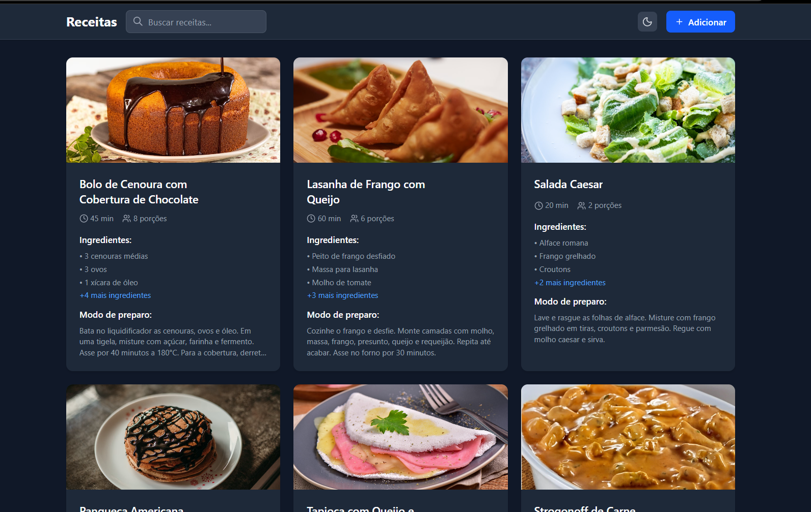
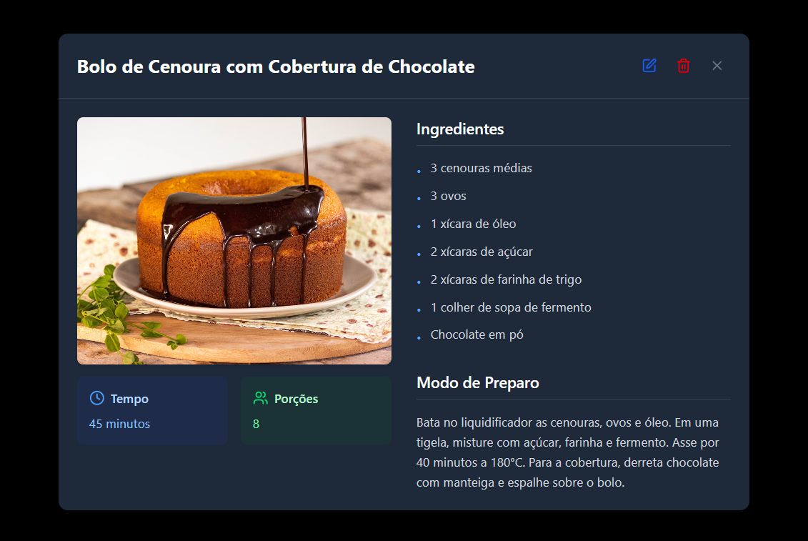
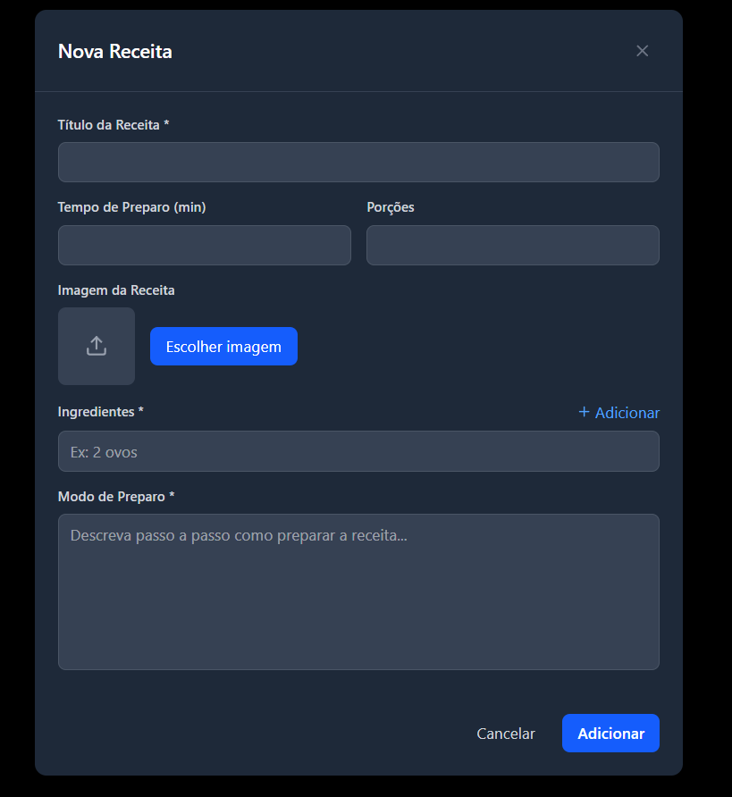

Minhas Receitas

Aplicação simples desenvolvida em React para estudo de conceitos básicos de CRUD (Create, Read, Update, Delete).

🚀 Tecnologias Utilizadas

  ⚡ Vite — Build tool rápida para desenvolvimento com React

  ⚛️ React JS — Biblioteca para construção da interface

  🎨 Tailwind CSS — Estilização com classes utilitárias

✅ Funcionalidades

✔️ Listagem de receitas cadastradas
✔️ Visualização de detalhes de uma receita
✔️ Criação de novas receitas
✔️ Edição de receitas existentes
✔️ Exclusão de receitas
✔️ Interface responsiva e com tema escuro (dark mode)

🛠 Como Executar o Projeto
# Clone o repositório
git clone https://github.com/seu-usuario/minhas-receitas.git

# Acesse a pasta
cd minhas-receitas

# Instale as dependências
npm install

# Inicie o servidor
npm run dev

📸 Prévia da Interface 

